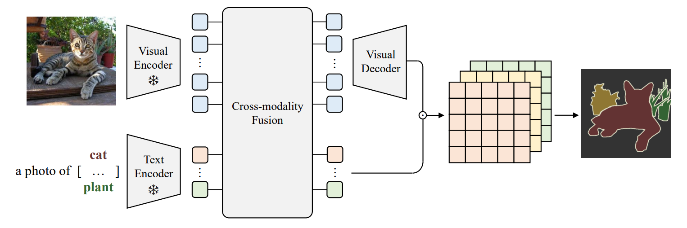

# Open-vocabulary Semantic Segmentation with Frozen Vision-Language Models

> Note: 
> 
> This code is being upgraded, we will release it in the near future.
> 
> Thanks for your patience. 🙏🙏🙏


The repo contains official PyTorch implementation of BMVC 2022 oral paper **Open-vocabulary Semantic Segmentation with Frozen Vision-Language Models** by Chaofan Ma*, Yuhuan Yang*, Yanfeng Wang, Ya Zhang, and Weidi Xie.



For more information, check out the [project page](https://yyh-rain-song.github.io/Fusioner_webpage/) and the paper on [arXiv](https://arxiv.org/abs/2210.15138).


## Citation

```bibtex
@inproceedings{ma2022fusioner,
  title     = {Open-vocabulary Semantic Segmentation with Frozen Vision-Language Models},
  author    = {Chaofan Ma, Yuhuan Yang, YanFeng Wang, Ya Zhang and Weidi Xie},
  booktitle = {British Machine Vision Conference},
  year      = {2022}
}
```

